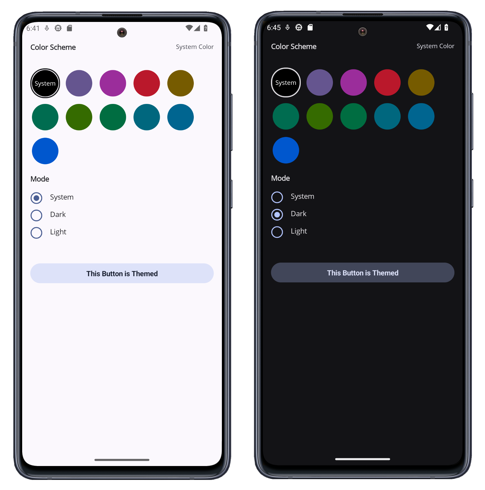

<!-- default badges list -->
[](https://docs.devexpress.com/GeneralInformation/403183)
<!-- default badges end -->

# Use DevExpress .NET MAUI Components to Build a Theme Selector App

This example uses DevExpress .NET MAUI Components to build a theme selector app.



## Included Controls and Their Properties

* [DXScrollView](https://docs.devexpress.com/MAUI/DevExpress.Maui.Core.DXScrollView)
* [DXStackLayout](https://docs.devexpress.com/MAUI/DevExpress.Maui.Core.DXStackLayout): [Orientation](https://docs.devexpress.com/MAUI/DevExpress.Maui.Core.DXStackLayout.Orientation), [ItemSpacing](https://docs.devexpress.com/MAUI/DevExpress.Maui.Core.DXStackLayout.ItemSpacing)
* [Label](https://learn.microsoft.com/en-us/dotnet/maui/user-interface/controls/label?view=net-maui-8.0): [Text](https://learn.microsoft.com/en-us/dotnet/api/microsoft.maui.controls.label.text?view=net-maui-8.0)
* [ChoiceChipGroup](https://docs.devexpress.com/MAUI/DevExpress.Maui.Editors.ChoiceChipGroup): [SelectedItem](https://docs.devexpress.com/MAUI/DevExpress.Maui.Editors.ChoiceChipGroup.SelectedItem), [IsMultiline](https://docs.devexpress.com/MAUI/DevExpress.Maui.Editors.ChipGroup.IsMultiline), [ItemsSource](https://docs.devexpress.com/MAUI/DevExpress.Maui.Editors.ChipGroup.ItemsSource), [ChipContentTemplate](https://docs.devexpress.com/MAUI/DevExpress.Maui.Editors.ChipGroup.ChipContentTemplate)
* [DXBorder](https://docs.devexpress.com/MAUI/DevExpress.Maui.Core.DXBorder): [BackgroundColor](https://learn.microsoft.com/en-us/dotnet/api/microsoft.maui.controls.visualelement.backgroundcolor?view=net-maui-8.0), [CornerRadius](https://docs.devexpress.com/MAUI/DevExpress.Maui.Core.DXViewBase.CornerRadius)
* [DXCollectionView](https://docs.devexpress.com/MAUI/DevExpress.Maui.CollectionView.DXCollectionView): [SelectedItemTemplate](https://docs.devexpress.com/MAUI/https://docs.devexpress.com/MAUI/DevExpress.Maui.CollectionView.DXCollectionView.SelectedItemTemplate), [ItemsSource](https://docs.devexpress.com/MAUI/DevExpress.Maui.CollectionView.DXCollectionView.ItemsSource), [ItemTemplate](https://docs.devexpress.com/MAUI/DevExpress.Maui.CollectionView.DXCollectionView.ItemTemplate)
* [DXButton](https://docs.devexpress.devx/MAUI/DevExpress.Maui.Core.DXButton): [Content](https://docs.devexpress.com/MAUI/DevExpress.Maui.Core.DXBorder.Content), [ButtonType](https://docs.devexpress.com/MAUI/DevExpress.Maui.Core.DXButton.ButtonType)

## Implementation Details

1. Use the [DXScrollView](https://docs.devexpress.com/MAUI/DevExpress.Maui.Core.DXScrollView) control as the root for the view layout. This way allows you to scroll content in both horizontal and vertical directions.

    ```xaml
    <dx:DXScrollView> 
        ... 
    </dx:DXScrollView>
    ```

2. Use the [ChoiceChipGroup](https://docs.devexpress.com/MAUI/DevExpress.Maui.Editors.ChoiceChipGroup) control to display and group round color markers that allow you to select a new color. To specify a round color marker, use the [DXBorder](https://docs.devexpress.com/MAUI/DevExpress.Maui.Core.DXBorder) control.

    ```xaml
    <dx:ChoiceChipGroup 
        SelectedItem="{Binding SelectedColor, Mode=TwoWay}" 
        ItemsSource="{Binding Items}" 
        IsMultiline="True"
        ... >
        <dx:ChoiceChipGroup.ChipContentTemplate>
            <DataTemplate>
                <dx:DXBorder BackgroundColor="{Binding Color}" ... >
                    <Label Text="{Binding Name}" ... />
                </dx:DXBorder>
            </DataTemplate>
        </dx:ChoiceChipGroup.ChipContentTemplate>
    </dx:ChoiceChipGroup>
    ```     

3. Use the [`DXCollectionView`](https://docs.devexpress.com/MAUI/DevExpress.Maui.CollectionView.DXCollectionView) control to display radio buttons that allow you to select a new theme. Specify the data source and item templates (use different templates for selected and deselected item).

    ```xaml
    <dx:DXCollectionView ...
            ItemsSource="{Binding ThemeTypes}" 
            AllowDeselectSingleItem="False"
            SelectionMode="Single"
            SelectedItem="{Binding SelectedThemeType, Mode=TwoWay}">

        <dx:DXCollectionView.SelectedItemTemplate>
            <DataTemplate>
                <dx:DXStackLayout Orientation="Horizontal" ... >
                    <dx:DXImage Source="radiobuttonchecked" ... />
                    <Label Text="{Binding Path=.}" ... />
                </dx:DXStackLayout>
            </DataTemplate>
        </dx:DXCollectionView.SelectedItemTemplate>

        <dx:DXCollectionView.ItemTemplate>
            <DataTemplate>
                <dx:DXStackLayout Orientation="Horizontal" ItemSpacing="15">
                    <dx:DXImage Source="radiobuttonunchecked" TintColor="{dx:ThemeColor Primary}"/>
                    <Label Text="{Binding Path=.}" FontSize="14"/>
                </dx:DXStackLayout>
            </DataTemplate>
        </dx:DXCollectionView.ItemTemplate>

    </dx:DXCollectionView>
    ```

4. The [DXButton](https://docs.devexpress.devx/MAUI/DevExpress.Maui.Core.DXButton) control changes its color if you tap a color marker or select a new theme.

    ```xaml
    <dx:DXButton ...
        Content="This Button is Themed" 
        ButtonType="Filled" />
    ```

## Files to Review

- [MainPage.xaml](./CS/MainPage.xaml)
- [MainPage.xaml.cs](./CS/MainPage.xaml.cs)
- [ThemesViewModel.cs](./CS/ViewModels/ThemesViewModel.cs)

## Documentation

* [DXScrollView](https://docs.devexpress.com/MAUI/DevExpress.Maui.Core.DXScrollView)
* [DXStackLayout](https://docs.devexpress.com/MAUI/DevExpress.Maui.Core.DXStackLayout)
* [Label](https://learn.microsoft.com/en-us/dotnet/maui/user-interface/controls/label?view=net-maui-8.0)
* [ChoiceChipGroup](https://docs.devexpress.com/MAUI/DevExpress.Maui.Editors.ChoiceChipGroup)
* [DXBorder](https://docs.devexpress.com/MAUI/DevExpress.Maui.Core.DXBorder)
* [DXCollectionView](https://docs.devexpress.com/MAUI/DevExpress.Maui.CollectionView.DXCollectionView)
* [DXButton](https://docs.devexpress.devx/MAUI/DevExpress.Maui.Core.DXButton)

## More Examples

* [DevExpress .NET MAUI Demo Center](https://github.com/DevExpress-Examples/maui-demo-app)
* [Stocks App](https://github.com/DevExpress-Examples/maui-stocks-mini)
* [Data Grid](https://github.com/DevExpress-Examples/maui-data-grid-get-started)
* [Data Form](https://github.com/DevExpress-Examples/maui-data-form-get-started)
* [Data Editors](https://github.com/DevExpress-Examples/maui-editors-get-started)
* [Charts](https://github.com/DevExpress-Examples/maui-charts)
* [Scheduler](https://github.com/DevExpress-Examples/maui-scheduler-get-started)
* [Tab Page](https://github.com/DevExpress-Examples/maui-tab-page-get-started)
* [Tab View](https://github.com/DevExpress-Examples/maui-tab-view-get-started)
* [Drawer Page](https://github.com/DevExpress-Examples/maui-drawer-page-get-started)
* [Drawer View](https://github.com/DevExpress-Examples/maui-drawer-view-get-started)
* [Collection View](https://github.com/DevExpress-Examples/maui-collection-view-get-started)
* [Popup](https://github.com/DevExpress-Examples/maui-popup-get-started)
